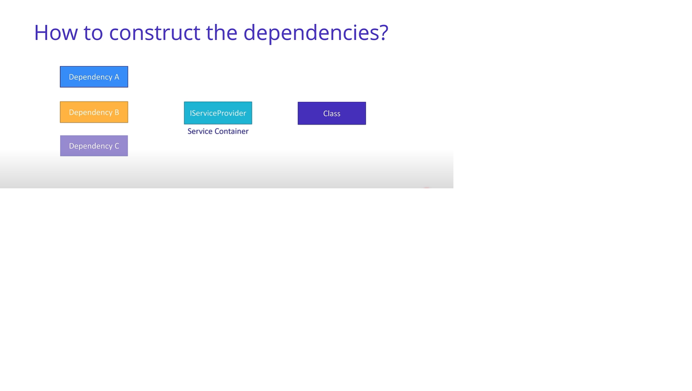

# .NET REST API Tutorial (entity, repo, controller)

## How to modal an entity via C# record types

1. Record types
- use for immutable objects
- with expression support 
- value-based equality support 
2. Dependency Injection, DTOs
- What is Dependency Injection?
    - Dependency inversion(principle): we use interface to implement lower module, inversion of controller this is design pattern based on Dependency inversion, how to design this partten by the ways: delegate, event, dependency injection,...           
    - Class ----use-----> Another Class(dependency) 
        - `public ItemsController() {repository = new InMemItemsRepository();}`
        - But we can use like this: 
        - `public ItemController (repository) {this.repository = repository}` 
    - Why? 
        - code is cleaner, easy to modify and easier to reuse 

    - 

    - 
- How to register and inject dependency in .NET5
- How to implement Data Transfer Objects (DTOs)

3. PUT, POST, DELETE
- How to create resouce with POST 
- How to validate the values of DTO properties 
- How to update resources with OUT 
- How to delete resources with DELETE

## How to implement an in-memory repositoty of resources
## How to implement a controller with GET routes to retrieve resources